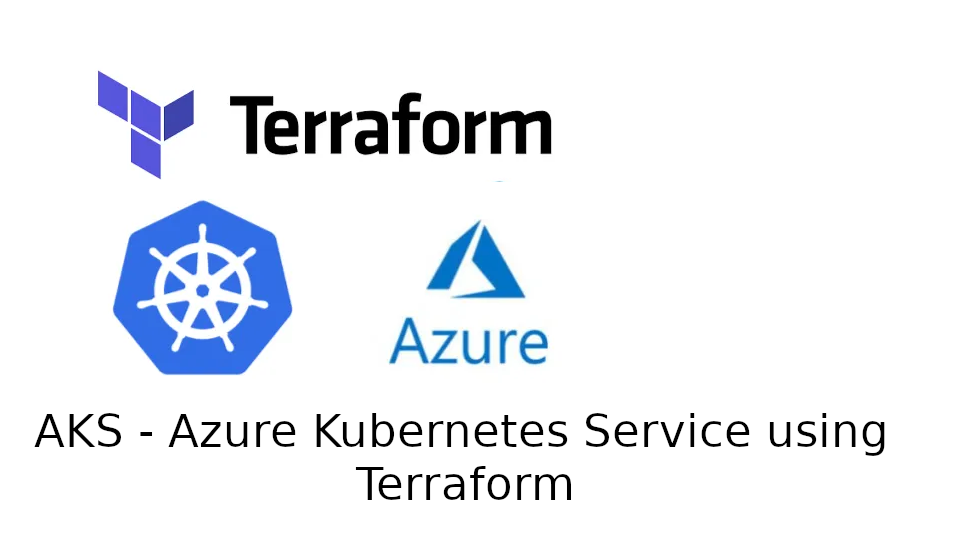

     

# AKS Cluster
## Table of Contents:
1. [A description of the project](#a-description-of-the-project)
2. [Usage instructions](#usage-instructions)
3. [File structure of the project](#file-structure-of-the-project)
4. [License information ](#license-information)

## A description of the project: 
- What it does:
    - This project creates an AKS cluster using Terraform.
- The aim of the project:
    - To understand the necessary steps to take to create an AKS cluster using Terraform.
- What you learned:
    - How to provision resources for Terraform
    - How to construct and utilise modules in Terraform
    - How to use variables
    - How to add sensitive variables into Terraform scripts without revealing the data
    - How to access AKS cluster services using `kubectl` commands on the AzureCLI
    - How to access the kubeconfig data from an AKS cluster once its been applied using `terraform apply`

## Usage instructions
- Once the repository has been cloned onto the local machine, the user will need to create a `secrets.tfvars` file. Replace the values in the quotation marks with the actual credentials as these will be needed later. In this file will need to be stored these values:
    - client_id        = "your_azure_client_id"
    - client_secret    = "your_azure_client_secret"
    - subscription_id  = "your_azure_subscription_id"
    - tenant_id        = "your_azure_tenant_id"
    - public_ip        = "your_public_ip_address"
- Now initialise terraform in each directory and subdirectory:
    - Change directory into the `networking-module` and run `terraform init` from the command line.
    - Change directory back to `AKS-TERRAFORM` directory and then into `aks-cluster-module` and run `terraform init` 
    - change back into `AKS-TERRAFORM` and run `terraform init`
- Once everything is initialised, from the `AKS-TERRAFORM` directory, run `terraform apply -var-file="secrets.tfvars"` to apply the terraform configuration with the sensitive data variables.

## File structure of the project
- AKS-TERRAFORM
    - main.tf
    - variables.tf
    - aks-cluster-module
        - main.tf:
        - variables.tf
        - outputs.tf
    - networking-module
        - main.tf
        - variables.tf
        - outputs.tf
    - logo.png
    - definitions.md
    - README.md
            

## License information 
##### __Copyright Karlos Moodios. All rights reserved.__